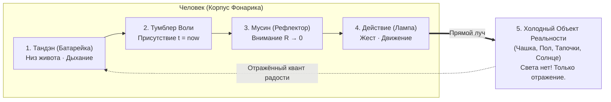

# Брошюра — Хикикомори и физика фонарика (Электродинамика запертого сознания, парадокс японского стыда и размыкание контура изоляции)

> [!quote] Главная аксиома контура
> ### ⚡ **«Фонарик не сломан, если в комнате темно. Фонарик цел, его батарейка заряжена жизнью, но его оптическая головка вывернута внутрь собственного корпуса. Человек не может спастись, разглядывая расплавленные внутренности. Чтобы прекратить ад омического огня, достаточно направить один квант луча наружу — на холодную, простую вещь.»**  
> — **Владимир Аньянов** (2026)

---

```
                       АРХИТЕКТУРНАЯ СХЕМА: ТРАГЕДИЯ И ОСВОБОЖДЕНИЕ
                       
   [ АВАРИЙНЫЙ РЕЖИМ ХИКИКОМОРИ: РАЗВОРОТ ЛУЧА ВНУТРЬ ]
   
     +-----------------------------------------------------------+
     | КОРПУС ЧЕЛОВЕКА                                           |
     |   [Тандэн: Батарейка] ---> [Мысли о стыде / Страх оценки] |
     |                                    |                      |
     |                           ОМИЧЕСКИЙ АД Q = I²Rt           |
     |                           (Плавление проводки)            |
     |                                    |                      |
     |      ВНУТРЕННИЙ ОГОНЬ <------------+                      |
     |      (Лампа светит внутрь головы, ослепляя человека)      |
     +-----------------------------------------------------------+
              | 
              X  (Дверь заперта: во внешнем мире — кромешный страх и тьма)
              
   ===============================================================
   
   [ ШТАТНЫЙ РЕЖИМ СВЕРХПРОВОДИМОСТИ: ЗАКОН ПРЯМОГО ЛУЧА ]
   
     +--------------------+
     | КОРПУС ЧЕЛОВЕКА    |        ПРЯМОЙ ЛУЧ           ХОЛОДНЫЙ ОБЪЕКТ
     | [Тандэн: Живот]    | ====(Мусин: Внимание)====> [Чашка чая / Пол]
     | [Дыхание свободно] |                                   |
     +--------------------+                                   |
              ^                                       ОТРАЖЁННЫЙ СВЕТ
              |                                     (Спокойная ясность)
              +----------------- ЗАМЫКАНИЕ ЦЕПИ <-------------+
```

---

## Введение: Трагедия миллиона закрытых дверей

В современной Японии за глухо запертыми дверями комнат живут сотни тысяч людей. Официальная статистика называет цифры от 800 000 до 1,5 миллиона человек. Феномен **хикикомори (ひきこもり)** давно перестал быть проблемой трудных подростков. Сегодня Япония переживает так называемый «кризис 80-50»: восьмидесятилетним родителям приходится на пороге немощи кормить пятидесятилетних сыновей и дочерей, не выходивших из комнат по двадцать-тридцать лет.

Общество смотрит на это с ужасом, медицина выписывает антидепрессанты, социологи обвиняют интернет, а благотворительные фонды пытаются годами стучаться в запертые квартиры. Но за тридцать лет ни одна психологическая школа не остановила эпидемию.

Почему? Потому что к хикикомори подходят с ложной гуманитарной парадигмой: его считают «сломанной личностью», «инфантильным беглецом» или «жертвой детской травмы».

Контурная электродинамика Системы Аньянова утверждает обратное: **Хикикомори аппаратно исправен.** Его организм генерирует энергию жизни каждое утро. Его беда — не в поломке деталей, а в **топологической аварии луча**. Хикикомори — это мощный карманный фонарик, чья линза механически завернута внутрь собственного корпуса.

---

## Часть I. Японский парадокс: Страна Тандэна, сгоревшая в Неокортексе

Историческая ирония ситуации поражает воображение. Именно японская культура подарила человечеству фундаментальные ключи к суверенитету сознания:
* **Тандэн (丹田)** — соматический центр тяжести и неиссякаемый аккумулятор жизненной силы (*ки*) внизу живота;
* **Мусин (無心)** — состояние «чистого ума» без эго-сопротивления, когда действие течет без помех мысли;
* **Дзансин (残心)** — непрерывное присутствие духа и готовность контура к изменениям;
* **Кансо (簡素)** — эстетика и инженерный канон предельной строгости, отсечения лишнего.

Эти принципы ковали самураев, мастеров меча, керамистов и создателей чайного канона. Но за последние шестьдесят лет сверхиндустриальное японское общество выстроило социальную матрицу с чудовищным паразитным сопротивлением:
1. **Сэкэн (世間)** — давящее поле коллективного ока, непрерывный суд окружающих;
2. **Мэйваку (迷惑)** — панический, парализующий ужас доставить кому-либо малейшее неудобство;
3. **Хадзи (恥)** — культура несмываемого позора за несоответствие социальному стандарту.

Когда молодой японец сталкивается с первой неудачей — провалом экзамена, травлей в школе (*идзимэ*) или увольнением из корпорации — социальное сопротивление среды кажется ему смертельным. Опасаясь омического удара от контакта с людьми, он захлопывает дверь своей комнаты. 

Он думает, что спасся. Но он попадает в электродинамическую ловушку, которая в сто раз страшнее школьного буллинга.

---

## Часть II. Схемотехника закрытой двери: Разворот луча и закон Джоуля — Ленца

Что происходит в физическом теле человека, закрывшего дверь комнаты?

Биологический генератор митохондрий и диафрагмы продолжает работать. Каждое утро в Тандэне вырабатывается постоянная электродвижущая сила:
$$\mathcal{E} > 0$$

Но внешний выход перекрыт: контакты с миром разорваны. А тумблер сознания включен! Человек не спит, он бодрствует по 16 часов в сутки. Куда деваться электрическому току внимания?

```
   ШТАТНЫЙ ХОД ТОКА:               АВАРИЙНЫЙ РАЗВОРОТ:
   [Тандэн] ===> [Дело в мире]     [Тандэн] ===> [ОБРАЗ СЕБЯ В ГОЛОВЕ]
   Тепло рассеивается наружу       Вся мощность бьет по собственным синапсам
   КПД созидания η → 100%          Q = I² · R_ego · t  (Омический ад)
```

Не имея права светить наружу, человек поворачивает прожектор внимания на 180 градусов — **вглубь самого себя**:
* *«Почему я такой ничтожный?»*
* *«Как я опозорил родителей?»*
* *«Что подумают обо мне соседи, если я выйду за дверь?»*
* *«Я упустил свои лучшие годы, мне уже поздно начинать.»*

В электродинамике это называется **паразитным самовозбуждением на замкнутом сопротивлении Эго** ($R_{\text{ego}} \gg 0$). По закону Джоуля — Ленца количество выделяющегося внутреннего тепла пропорционально квадрату тока:
$$Q = I^2 \cdot R_{\text{ego}} \cdot t$$

Это не фигура речи. Это физика:
* Неокортекс раскаляется, перегружая дефолт-систему мозга (DMN);
* Уровень хронического кортизола и адреналина зашкаливает;
* Тело зажимается в спазмах (плечи подняты, диафрагма парализована, дыхание поверхностное);
* Внутри черепной коробки бушует пожар вины, а во внешнем мире перед человеком стоит непроглядная, парализующая тьма.

Чем дольше человек сидит в комнате, тем больше расплавлен его внутренний контур. И когда родитель или социальный работник открывает дверь и говорит: *«Ну же, соберись, найди работу, выйди на улицу!»*, хикикомори реагирует вспышкой паники или агрессии. Не потому, что он ленив. А потому, что **его проводка расплавлена до голого нихрома, и любое внешнее требование вызывает короткое замыкание.**

---

## Часть III. Крах психологических эпициклов: Почему анализ травм убивает

Традиционная западная психология и психиатрия, приходя на помощь хикикомори, совершают грубейшую схемотехническую ошибку. Они предлагают:
1. *«Давай раскопаем корни твоего стыда»*;
2. *«Вспомни, как учитель отругал тебя в третьем классе»*;
3. *«Осознай свои подавленные эмоции и проработай травму отвержения»*.

Для застрявшего фонарика это звучит как смертный приговор. Психотерапевт фактически берет увеличительное стекло и говорит: *«Ты видишь, как оплавилась пластиковая гильза внутри твоего фонарика? Давай посветим на эту гарь еще ярче! Давай опишем форму каждой копоти!»*.

Это плодит бесконечные **птолемеевы эпициклы**. Человек погружается в самокопание еще глубже. Он находит двадцать новых диагнозов, оправдывает свое сидение в комнате концепциями «непрожитого горя» и цементирует свое затворничество.

### Закон неразворачиваемости луча (Канон Кансо):
> **Фонарик не предназначен для освещения собственных аккумуляторов.** Глаз не может увидеть сетчатку своего глаза. Внимание — это векторный луч, рожденный для встречи с внешней нагрузкой. Попытка направить луч внутрь — авария конструкции.

Чтобы починить застрявший фонарик, **не нужно ремонтировать темноту**. Не нужно «избавляться от страха», чтобы выйти наружу. Нужно просто повернуть оптическую головку в исходное, проектное положение.

---

## Часть IV. Пять узлов Карманного Фонарика: Аппаратная топология спасения

В Системе Аньянова модель человека предельно проста и лишена мистического тумана. Она состоит из **пяти функциональных узлов**:

| Узел схемы | Анатомический субстрат | Функция в контуре | Ошибка хикикомори |
| :--- | :--- | :--- | :--- |
| **1. Батарейка (Тандэн)** | Низ живота, диафрагма, митохондрии | Источник постоянной ЭДС ($\mathcal{E} > 0$) | Забыт; энергия стянута в кипящую голову |
| **2. Тумблер (Воля)** | Префронтальный фокус $t = \text{now}$ | Включение сети прямого действия (TPN) | Залип в режиме ментального холостого хода DMN |
| **3. Рефлектор (Мусин)** | Шина внимания, зеркальная проводимость | Фокусировка луча без эго-сопротивления ($R \to 0$) | Искривлен стыдом и страхом чужой оценки ($R \gg 0$) |
| **4. Лампа (Эмиттер)** | Физическое соматическое действие | Преобразование тока в движение (руки, ноги, голос) | Заблокирована запретом на проявление себя |
| **5. Нагрузка (Мир)** | Внешний холодный предмет прямо сейчас | Замыкание цепи через полезную работу | Подменена внутренними кошмарами фантазий |



### Открытие Великой Ошибки Атрибуции:
Хикикомори боится внешнего мира, потому что мир кажется ему холодным, безжалостным и страшным. Но мир сам по себе **нейтрален**. Вещи вокруг — чайник, циновка татами, дверная ручка, ветка дерева за окном — абсолютно темны и холодны. В них нет собственного зла, как нет и собственного сияния.

Красота, тепло и смысл появляются в мире ровно в ту секунду, когда луч твоего собственного внимания падает на них. **Мир оживает только в луче твоего фонарика.** Запираясь в комнате, ты погружаешь мир во тьму своими собственными руками.

---

## Часть V. Протокол Дэай (出会い) и Микро-нагрузка: Как вернуть луч без шока

Главная ошибка социальных служб при работе с затворниками — попытка навязать им **несоразмерную нагрузку**.

Человеку, не выходившему из дома пять лет, предлагают:
* *«Пойди на собеседование в магазин»*;
* *«Познакомься со сверстниками в клубе»*;
* *«Выступи на групповой терапии»*.

В схемотехнике это эквивалентно попытке подключить тоненький карманный светодиод к трансформаторной будке 10 киловольт. Сопротивление социального контакта ($R_{\text{social}}$) мгновенно сжигает предохранитель, и человек захлопывает дверь еще на пять лет.

### Принцип микро-импеданса (Согласование нагрузки):
Ток должен потечь наружу, но на нагрузку с **нулевой социальной опасностью**. Нагрузка должна быть неодушевленной, безоценочной и физической:

```
    УРОВЕНЬ 1: Нагрузка = 0 Ом (В пределах комнаты)
    - Почувствовать пятками прохладу пола;
    - Налить тонкую струйку воды в стакан и смотреть на пузырьки;
    - Положить ладонь на живот ниже пупка и сделать 3 выдоха в Тандэн.
    
    УРОВЕНЬ 2: Микро-действие в физическом мире
    - Заварить зеленый чай сенча, не думая о прошлом;
    - Протереть пыль с подоконника влажной тряпкой;
    - Открыть штору на 5 сантиметров и впустить луч утреннего солнца.
    
    УРОВЕНЬ 3: Протокол Дэай (出会い — Чистая встреча без оценки)
    - Выйти на порог дома в 5 утра, когда на улице никого нет;
    - Сделать вдох свежего уличного воздуха;
    - Посмотреть на асфальт под ногами: асфальт не осуждает, не требует отчета, он просто держит вес тела.
```

Как только первый фотон внимания упал на тряпку, чай или асфальт — **внутренний омический нагрев падает до нуля**. Голова остывает. Проводка цепи начинает заживать.

---

## Часть VI. Обращение к общественным организациям Японии

Мы направляем этот манифест японским ассоциациям поддержки хикикомори, родительским комитетам и дзэнским центрам:
* **KHJ (全国ひきこもり家族会連合会)** — Национальной федерации семейных ассоциаций хикикомори;
* **NPO «New Start» (ニュースタート事務局)** и движению «прокатных сестер» (*Rental Oneesan*);
* Социальным центрам поддержки молодежи (Hikikomori Regional Support Centers).

### Что мы предлагаем изменить в подходе к затворникам:

1. **Снять с хикикомори клеймо «больного» или «виновного».**
   Перестаньте требовать от них «покаяния», «социальной зрелости» или «преодоления инфантилизма». Объясните родителям на пальцах: их сын или дочь — это исправный прибор, заклинивший в режиме внутреннего отражения.
   
2. **Заменить психологические разговоры физической калибровкой.**
   Когда волонтёр или «сестра» приходит к закрытой двери, не нужно через щель спрашивать: *«Что ты чувствуешь? Почему ты не хочешь учиться?»*. 
   Нужно предложить микро-резонанс без слов: передать чашку теплого чая; положить красивый осенний лист; попросить помочь починить сломанный карандаш. Перевести фокус с оценки личности на физический контакт с материей.

3. **Вернуть Японии её собственный Тандэн.**
   Западная когнитивная терапия заставляет человека думать о мыслях. Традиционный японский подход должен вернуть человека в **Хара (腹)** — в тело, в дыхание, в ручной труд (*саму*). Человек, рубящий дрова или пропалывающий мох в монастырском саду, физически не может быть хикикомори: его фонарик на 100% занят освещением грядки.

---

## Часть VII. Двуязычный японский манифест: 懐中電灯の原理 (Принцип карманного фонарика)

Ниже приводится текст полевой памятки, переведенный на японский язык для непосредственной передачи затворникам, их родителям и кураторам.

```
================================================================================
                    懐中電灯の原理（ひきこもり脱出の回路設計）
               The Principle of the Pocket Flashlight for Hikikomori
================================================================================

あなたは壊れていません。あなたのバッテリーは生きています。
部屋が暗いのは、あなたがダメな人間だからではありません。
懐中電灯のレンズが、内側の機械に向けて曲がってしまっているだけです。

【 人間の基本回路：5つの要素 】

1. 丹田（たんでん / バッテリー）
   おへその下、呼吸の力。毎日新しく充電される生命のエネルギー。
   頭の不安とは無関係に、あなたの体は今も生きています。

2. 意志のスイッチ
   「今、ここ」に意識を合わせるカチッというスイッチ。
   過去の後悔や未来の恐怖から離れ、現在の瞬間に接続します。

3. 無心（むしん / 反射鏡）
   他人の目を気にしない、抵抗ゼロ（R = 0）の純粋な注意。
   恥や世間体という埃を拭き取れば、光は真っ直ぐに伸びます。

4. 行動のエミッター（電球）
   手、足、声による小さな物理的動作。
   エネルギーを外の世界へと放出する出口です。

5. 冷たい外部現実（照らされる対象）
   お茶、床、空、ドアノブ。
   それ自体には光も恐怖もありません。あなたが光を当てた瞬間、色を帯びます。

--------------------------------------------------------------------------------
【 回路事故の正体：ジュール熱（自責の地狱） 】

光を無理に自分自身の頭（内側）に向けると、回路はショートします。
「なぜ自分はこうなんだ」「どうして動けないんだ」と考え続けると、
配線が焼け焦げ、心の中で激しい熱（苦しみ・パニック）が生まれます。

心の中をいくら照らしても、答えは見つかりません。
懐中電灯は、自分自身の電池を照らすようには作られていないからです。

--------------------------------------------------------------------------------
【 脱出のための3ステップ（直接照射の法則） 】

ステップ 1：息をお腹（丹田）に落とす
頭の中の会話を止め、お腹のふくらみと縮みに3回だけ意識を向けます。

ステップ 2：自分を治そうとしない
自信がつくのを待つ必要はありません。不安のままで構いません。
電球は「完璧な気持ち」にならなくても、ボタンを押せば光ります。

ステップ 3：外の小さな物に光を1つ当てる
大きな挑戦（仕事、面接、人混み）は必要ありません。
・コップに水を注ぎ、その水面を見る。
・足の裏で床の冷たさを感じる。
・窓を1センチ開けて、外の風に触れる。

光が外に出た瞬間、内側の火事は止まります。
世界はあなたを裁いていません。
世界はただ、あなたの光によって照らされるのを待っています。
================================================================================
```

---

## 🛠 Практический алгоритм: Протокол выхода «Свет наружу» (Light-Out Protocol)

Этот алгоритм рассчитан на 60 секунд. Его может выполнить любой человек, застрявший в ступоре, панике или многомесячной изоляции.

```
+------------------------------------------------------------------------------+
|               ЭКСПРЕСС-ПРОТОКОЛ КАЛИБРОВКИ ЛУЧА (60 СЕКУНД)                  |
+------------------------------------------------------------------------------+
|                                                                              |
|  [ШАГ 1. СБРОС ИЗ ГОЛОВЫ В ТАНДЭН] (0-20 сек)                                |
|  - Опусти глаза в пол.                                                       |
|  - Положи правую ладонь на живот на 3 пальца ниже пупка.                     |
|  - Сделай глубокий выдох носом до конца, чувствуя сдувание живота.           |
|  - Скажи себе: «Генератор включён. Батарейка в порядке».                     |
|                                                                              |
|  [ШАГ 2. СНЯТИЕ ТРЕБОВАНИЯ СЕБЯ ЛЮБИТЬ / ЧИНИТЬ] (20-40 сек)                 |
|  - Прекрати попытки успокоиться или перестать бояться.                       |
|  - Зафиксируй факт: фонарик не обязан нравиться себе, чтобы светить.        |
|  - Полное право быть напуганным, неидеальным, растерянным.                  |
|                                                                              |
|  [ШАГ 3. ВЫСТРЕЛ ЛУЧА В БЕЗОЦЕНОЧНЫЙ ПРЕДМЕТ] (40-60 сек)                    |
|  - Выбери любой физический предмет в радиусе вытянутой руки:                 |
|    край одеяла, кружку, дверную ручку, пылинку в луче света.                |
|  - Подойди и коснись его пальцами.                                           |
|  - Удерживай 100% внимания на текстуре: гладкая, шершавая, холодная, теплая. |
|                                                                              |
|  ИТОГ: Ток пошёл наружу. Внутренний омический пожар потушен. Цепь замкнута.  |
+------------------------------------------------------------------------------+
```

---

## Резюме: Семь аксиом выхода из заключения

1. **Человек — это автономный оптико-электрический фонарик.** Источник питания находится внутри тебя по праву рождения. Мир снаружи темен и холоден сам по себе, и оживает только под твоим падающим лучом.
2. **Феномен хикикомори — не поломка, а топологическая инверсия.** Вся беда затворника в том, что стоваттный прожектор его сознания вывернут внутрь черепной коробки.
3. **Закон Джоуля — Ленца непреложен:** Попытка жечь энергию на сопротивлении собственного стыда ($R_{\text{ego}} > 0$) порождает внутренний ад ($Q = I^2 R t$). Чем больше рефлексии — тем сильнее ожог проводки.
4. **Закон неразворачиваемости луча:** Не пытайся «разобраться в себе» перед тем, как выйти. Фонариком нельзя осветить его собственную батарейку. Внимание лечит только тогда, когда светит вовне.
5. **Фонарику не нужна идеальная самооценка:** Тебе не нужно становиться уверенным, общительным или смелым. Достаточно просто нажать кнопку действия в текущем теле.
6. **Правило микро-импеданса:** Не начинай с общества и корпораций. Направь луч на воду, пол, чайник, татами. Материя никогда не предаст и не осудит.
7. **Спасение через действие:** В ту секунду, когда хотя бы один фотон твоего внимания осветил реальный предмет за пределами эго-мыслей, добровольное заключение заканчивается. Ты снова включен в общую сеть бытия.
