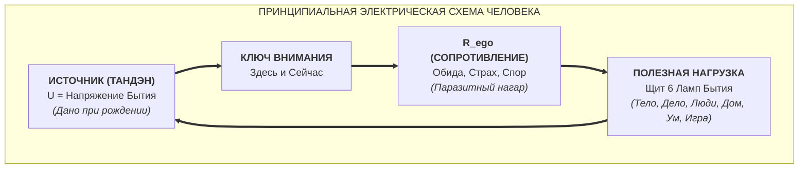

# Коперник Сознания: Анатомия эго и физика внутренней свободы
## Почему сопротивление не может быть проводником, как дребезжащий лад возомнил себя душой и почему убрать ложное «Я» проще, чем вымыть руки
**Автор:** Владимир Аньянов  
**Серия:** Библиотека «Внутренний ток»  
**Статус:** Каноническая мастер-рукопись книги  

---

> [!quote] Главная аксиома книги
> «Ты не можешь быть сопротивлением, потому что ты — это ток. Ты не можешь быть дребезгом на третьем ладу, потому что ты — резонатор, сквозь который играет Жизнь. Пятнадцать веков астрономы громоздили круги внутри кругов, пытаясь объяснить движение планет вокруг неподвижной Земли, пока Коперник просто не поставил в центр Солнце. Десять тысяч лет человечество страдает от обид, страхов и чувства вины, пытаясь "исцелить" своё эго, пока не поймёт: эго никогда не было центром. Стоит вернуть Ток Жизни в центр Вселенной, и паразитный шум исчезает сам: никто не держит в кулаке раскалённый уголь, когда видит, что этот уголь — не его рука.»  
> 
> — **Владимир Аньянов**

---

## Содержание книги

- **Предисловие автора.** Интуиция Коперника: почему один сдвиг точки отсчёта отменяет десять тысяч лет страданий.
- **Часть I. Птолемеевский морок: Почему все запутались?**
  - *Глава 1.* Вавилонская башня птичьего языка: как религия, философия и психология заблудились в трех соснах.
  - *Глава 2.* Эпициклы страдания: почему борьба с мыслями только подкармливает шум.
  - *Глава 3.* Если бы укулеле сошла с ума: акустическая анатомия расшатанного колка.
  - *Глава 4.* Капкан непрерывности: почему монотонный зуд саванного сторожа принимают за бессмертную душу.
- **Часть II. Коперниканский переворот: Физика цепи**
  - *Глава 5.* Солнце вместо Земли: возвращение Источника в центр существа.
  - *Глава 6.* Закон проводимости: почему река не может быть плотиной ($I_{\text{life}} \neq R_{\text{ego}}$).
  - *Глава 7.* Великая ловушка вопроса: «Ну хорошо, я всё понял, а КАК мне это убрать?».
  - *Глава 8.* Метафора раскалённого угля: почему для освобождения не нужны двадцать лет сидения в пещерах.
- **Часть III. Санитарная революция сознания: Гигиена вместо мистики**
  - *Глава 9.* Эффект Земмельвейса: эго как немытые руки, а не первородный грех.
  - *Глава 10.* Тайна полой деки: почему музыка рождается только в чистой пустоте (Шуньята без тумана).
  - *Глава 11.* Эго-рантье: экономика украденного потока и закон Генри Джорджа в психике.
- **Часть IV. Сверхпроводимость в действии: Как звучит живой человек**
  - *Глава 12.* Смерть без умирания: почему без дребезга ты не станешь овощем, а станешь Страдивари.
  - *Глава 13.* Шесть ламп чистой нагрузки: куда устремляется ток, когда клеммы очищены.
  - *Глава 14.* Карманный калибратор: протокол мгновенного распознавания паразитного шума в реальной жизни.
- **Заключение.** Чистый проводник: счастье быть открытым контуром.

---

## Предисловие автора. Интуиция Коперника

На протяжении всей письменной истории человечество бьётся над одной и той же невыносимой загадкой: **почему разумное, одарённое сознанием существо так отчаянно и непрерывно страдает?**

Мы победили чуму и оспу. Мы научились расщеплять атомное ядро, отправлять зонды к границам Солнечной системы и помещать библиотеку всего человечества в плоскую стеклянную пластинку в кармане брюк. Но когда современный человек вечером остаётся один в тишине спальни, внутри его черепа включается всё та же древняя, беспощадная шарманка:
- *«А что, если завтра всё рухнет?»*
- *«Как он посмел со мной так поступить?»*
- *«Я недостаточно хорош, мне нужно доказать свою ценность...»*
- *«Меня не оценили, меня обидели, меня не поняли...»*

Тысячелетиями нам предлагали лекарства от этой душевной боли.
**Религия** заявила, что человек испорчен от рождения, что эго — это дьявольская гордыня, и его нужно усмирять постами, покаянием и страхом вечных мук.  
**Академическая философия** написала миллионы страниц на птичьем, зубодробительном языке, объясняя, что субъективное «Я» — это трансцендентальное единство апперцепции, познающее вещь в себе через призму категориального аппарата. Человек закрывает эти книги с тяжёлой головой и понимает, что легче ему не стало ни на йоту.  
**Современная психология и коучинг** пошли другим путём: они сделали из эго коммерческий культ. Вас учат «прокачивать личные границы», «лечить внутреннего ребёнка», «поднимать самооценку» и «договариваться со своим критиком». Но парадокс в том, что после двадцати сессий психотерапии человек просто начинает страдать более квалифицированно, оперируя терминами «абьюз», «триггер» и «токсичность».

Почему все эти подходы пробуксовывают?

Потому что все они совершают одну и ту же ошибку, которую совершала астрономия на протяжении полутора тысяч лет до Николая Коперника.

```
       ПТОЛЕМЕЙ (ГЕОЦЕНТРИЗМ)                   КОПЕРНИК (ГЕЛИОЦЕНТРИЗМ)
  Земля («Я») неподвижна в центре.            Солнце (Источник) в центре.
  Планеты делают дикие петли.                 Орбиты просты и естественны.
  Чтобы спасти модель, выдумывают             Земля — просто одна из планет,
  бесконечные круги в кругах (эпициклы).       вращающаяся вокруг света.
```

Клавдий Птолемей исходил из очевидного для глаз факта: мы стоим на неподвижной Земле, а Солнце и звёзды кружат вокруг нас. Но планеты вели себя странно: они то замедлялись, то пятились назад. Чтобы объяснить эти парадоксы, астрономам приходилось нагромождать безумные математические костыли — круги внутри кругов, колеса на колесах. Система скрипела, становилась чудовищно сложной, но оставалась тупиковой.

Коперник не стал изобретать ещё более сложные эпициклы. Он сделал одно простое действие, от которого перехватило дух у всей науки:  
**Он убрал наблюдателя из центра.**  
Он поставил в центр Солнце. И в ту же секунду все петли распрямились, все громоздкие формулы рухнули за ненадобностью, а небосвод стал кристально ясен.

Эта книга делает ровно то же самое с человеческой психикой.

Мы уберём ложное, суетливое, перепуганное «Я» из центра Вселенной. Мы поставим в центр то, что там было всегда: **чистый, бессмертный Ток Жизни**. А то, что мы десять тысяч лет по ошибке называли своей личностью, займёт своё истинное, скромное место — место обыкновенного сопротивления на проводнике, нагара на клемме или дребезжащего порожка на укулеле.

И когда вы увидите эту схему своими глазами — простыми словами, на понятных бытовых примерах, — спорить станет невозможно. Не потому, что вас кто-то переубедил, а потому что вы увидите реальную физику своего контура.

Давайте снимем очки Птолемея и посмотрим, как устроена цепь на самом деле.

---

# Часть I. Птолемеевский морок: Почему все запутались?

## Глава 1. Вавилонская башня птичьего языка

Когда мы берем в руки руководство по эксплуатации холодильника или схему простого фонарика, у нас не возникает споров. Если лампочка не горит, никто не созывает богословский собор, чтобы выяснить, не согрешила ли батарейка. Никто не пишет диссертацию по феноменологии потухшей вольфрамовой нити. Мастер просто берет тестер и проверяет три вещи:
1. Есть ли напряжение на источнике?
2. Замкнута ли цепь?
3. Где возник обрыв или паразитное сопротивление?

Но как только речь заходит о человеке, инженерная трезвость немедленно уступает место птичьему языку.

```
┌────────────────────────────────────────────────────────────────────────┐
│               ЧЕТЫРЕ КАТЕГОРИИ ПТИЧЬЕГО ЯЗЫКА О ЧЕЛОВЕКЕ              │
├─────────────────┬──────────────────────────────────────────────────────┤
│ 1. РЕЛИГИЯ      │ «Ты грешен, смиряй гордыню, бойся кары, молись»      │
│ 2. ФИЛОСОФИЯ    │ «Субъект трансцендирует объект через антиномии разума»│
│ 3. ЭЗОТЕРИКА    │ «Вибрируй на высоких частотах, открывай шестую чакру» │
│ 4. ПСИХОЛОГИЯ   │ «Проработай гештальт, перепроживи травму пятилетнего»│
└─────────────────┴──────────────────────────────────────────────────────┘
```

Каждая из этих систем искренне пытается помочь, но каждая говорит на своём зашифрованном диалекте. В результате обычный человек чувствует себя безнадёжно сломанным. Ему кажется: чтобы перестать мучиться от обиды на начальника или страха перед будущим, нужно либо уйти в монастырь на двадцать лет, либо выучить словарь французских постмодернистов, либо отнести годовой доход психоаналитику.

В чём корневая ошибка всех четырёх подходов?

**Они говорят о следствиях, не понимая принципиальной схемы прибора.**

Представьте дикаря, нашедшего транзисторный приёмник. Приёмник шипит, хрипит и ловит помехи, потому что ручка настройки сбита с волны.  
- Религиозный дикарь скажет: *«Приёмник проклят за то, что сделан из тёмного пластика. Нужно посыпать его пеплом и бить поклоны»*.  
- Философский дикарь сядет рядом и напишет труд: *«О сущностной апории шума как модуса звучания»*.  
- Эзотерический дикарь начнёт окуривать антенну шалфеем.  
- Психологический дикарь положит приёмник на кушетку и станет выспрашивать: *«А что транзистор чувствовал, когда его впаивали на фабрике в Гуанчжоу?»*.

Но приходит инженер. Он не спорит ни с кем. Он просто смотрит на схему, видит, что частота сдвинута на полтора мегагерца, поворачивает верньер настройки — и комната мгновенно наполняется чистейшей симфонией Моцарта.

Приёмник не был испорчен. Шум не был его душой. Шум был всего лишь **помехой на линии**.

---

## Глава 2. Эпициклы страдания: почему борьба с мыслями только подкармливает шум

Чтобы понять, почему традиционные методы борьбы с эго не работают, вернемся к средневековой астрономии.

Когда Птолемей объявил Землю неподвижным центром мироздания, перед ним встала неразрешимая проблема: если Земля в центре, почему Марс иногда останавливается на ночном небе, чертит петлю назад и только потом продолжает путь?

Вместо того чтобы усомниться в исходной догме, Птолемей сделал логичный на первый взгляд костыль: он предположил, что планета вращается не вокруг Земли, а вокруг воображаемой пустой точки (эпицикла), а вот этот эпицикл уже вращается вокруг Земли (деферента).

```
         ПТОЛЕМЕЕВСКИЙ ЭПИЦИКЛ              ПСИХОЛОГИЧЕСКИЙ ЭПИЦИКЛ
             ┌───○ Планета                       ┌───○ Стыд за злость
             │  /                                │  /
          ┌──┴─○ Центр эпицикла               ┌──┴─○ «Я плохой христианин»
          │                                   │
          ▼                                   ▼
      ● ЗЕМЛЯ («Я»)                       ● ЗЕМЛЯ («Я разозлился»)
```

Но когда астрономические измерения стали точнее, выяснилось, что один эпицикл не сходится с наблюдениями. Пришлось посадить на первый эпицикл второй! Потом третий! К XVI веку модель Птолемея насчитывала десятки сложнейших шестерёнок, колес внутри колес, превратившись в громоздкого монстра, которого не понимал никто, кроме горстки жрецов.

А теперь посмотрите, как устроен типичный внутренний диалог страдающего человека:

1. **Базовый факт реальности:** начальник сделал вам несправедливое замечание. В теле возник физиологический импульс (сжатие, прилив крови).
2. **Первый эпицикл (Эго-захват):** *«Как он смел?! Я же лучший сотрудник! Он меня не ценит!»* (Появилась обида).
3. **Второй эпицикл (Морализаторство):** *«Стоп, я же занимаюсь осознанностью! Я духовный человек! Злиться нельзя, злость разрушает печень. Почему я такой несдержанный?»* (Появилось чувство вины).
4. **Третий эпицикл (Борьба):** *«Так, срочно начинаю прощать. Закрываю глаза, шлю ему лучи безусловной любви... Почему лучи не шлются?! Чёрт, я лицемер!»* (Появилось отчаяние).
5. **Четвертый эпицикл (Психоаналитический):** *«Наверное, начальник напоминает мне строгого отца в шесть лет, когда он отобрал у меня конструктор... Нужно записаться на расстановки!»*.

Поздравляем: вы построили пять астрономических эпициклов на пустом месте!

А теперь заметьте ключевую деталь: **кто строил все эти эпициклы?**  
Их строило то же самое эго!  
Оно разозлилось, оно же себя обвинило, оно же решило заняться духовностью, оно же расстроилось от неудачи и оно же пошло искать терапевта.

Это замкнутый самовоспроизводящийся пожар. Когда вы пытаетесь победить эго с помощью техник, волевых усилий или чувства вины, вы пытаетесь **тушить пожар бензином**. Каждое усилие по «борьбе с эго» делает само эго ещё толще, важнее и монументальнее.

---

## Глава 3. Если бы укулеле сошла с ума: акустическая анатомия расшатанного колка

В нашей предыдущей книге («Укулеле Бытия») мы доказали, что маленькая четырёхструнная гавайская гитара весом в 400 граммов является идеальной, неопровержимой моделью человеческого существа. 

Давайте проведём предельно простой мысленный эксперимент, который раз и навсегда расставит все точки над «i» в вопросе природы эго.

Представьте укулеле, изготовленную из отличной сухой махагони. Она лежит на коленях музыканта. Корпус — это физическое тело. Струны — контуры внимания. Пустота внутри деки — чистое пространство осознания. Музыкант — сама Жизнь.

```
          АКУСТИЧЕСКАЯ МОДЕЛЬ: ДРЕБЕЗЖАЩИЙ ЛАД ПРОТИВ МЕЛОДИИ

       ┌────────────────────────────────────────────────────────┐
       │                 УКУЛЕЛЕ (ПРОВОДНИК)                    │
       │                                                        │
       │  [ПУСТОЙ РЕЗОНАТОР] ──► Свободный отклик струны        │
       │            │                                           │
       │            ▼                                           │
       │  [РАСШАТАННЫЙ КОЛОК] ──► «Дззз-тррр... Я — личность!»   │
       │  (Паразитный дефект)   (Присвоение звука, страх тишины)│
       └────────────────────────────────────────────────────────┘
```

Музыкант мягко касается струны До ($C$). Воздух оживает, рождается бархатная, округлая нота, готовая раствориться в пространстве комнаты и принести слушателю покой.

Но на пере головки грифа чуть ослаб крепежный винтик маленького металлического колка. И когда струна вибрирует, этот расшатанный винтик начинает мелко, дребезжаще стучать о металлическую шайбу:  
*«Дзззз... трррр... дзззз...»*

А теперь представьте, что эта укулеле вдруг обрела человеческий омрачённый рассудок.

Что происходит?

### 1. Объявление поломки своей индивидуальностью
Вместо того чтобы понять: *«Я — поющий инструмент, созданный для музыки»*, укулеле вслушивается в этот зуд и восклицает:  
> *«О! Вы слышите этот неповторимый сухой треск на частоте 400 герц? Вот это и есть НАСТОЯЩАЯ Я! Вот моя уникальная глубина, моя сложная судьба! Музыка — это банальный внешний поток, который льется через любые дрова. А вот этот дребезжащий надрыв — моя аутентичность. Не смейте прикасаться к моему винтику!»*

### 2. Панический страх тишины и пауз
Любая живая музыка состоит не только из звуков, но и из **пауз между нотами**. Музыкант снимает палец со струны. В комнате повисает хрустальная, звенящая тишина.  
Для укулеле с раздутым эго эта тишина равносильна мгновенной смерти:  
> *«Колок замолчал! Треска больше нет! Я умираю! Небытие поглощает меня! Срочно, зацепись за рукав рубашки, скрипни порожком об колено, поймай сквозняк — только бы продолжать вибрировать!»*

Именно поэтому человек так боится остаться в тишине без телефона, без наушников и без телевизора. Ему кажется, что если мысленный зуд в голове смолкнет хотя бы на минуту, он перестанет существовать.

### 3. Присвоение аплодисментов
Когда песня допета и зал взрывается аплодисментами, безумный инструмент самодовольно решает:  
> *«Видели, как публика рыдала? Это всё благодаря моему великолепному дребезжанию на третьем такте! Если бы не мой расшатанный винт, эта песня осталась бы пресной!»*

---

А теперь скажите честно: **возможно ли представить, чтобы хоть один скрипичный или гитарный мастер в мире согласился с этой укулеле?**

Придёт ли в голову мастеру сказать:  
*«Да, этот противный треск расшатанного металла — это святая душа инструмента. Давайте откроем институт по изучению детских травм этого колка. Давайте двадцать лет медитировать на этот звук, чтобы принять его теневую сторону»*?

Никогда в жизни!  
Мастер молча достанет из кармана маленькую отвёртку, сделает пол-оборота по часовой стрелке — и дребезг исчезнет навсегда. А укулеле впервые за долгие годы вздохнет с невероятным облегчением и наконец-то услышит, насколько прекрасна та песня, которую сквозь неё всегда хотел сыграть Музыкант.

Человеческое эго — это **в точности тот самый дребезжащий колок**. Не больше и не меньше.

---

## Глава 4. Капкан непрерывности: почему саванного сторожа принимают за душу

Возникает фундаментальный вопрос: если эго — всего лишь механический дефект, почему человечество купилось на эту иллюзию? Почему миллиарды умнейших людей на протяжении тысячелетий верят, что этот ментальный шум и есть их сущность?

Ответ кроется в **акустической ловушке непрерывности**.

```
             МЕЛОДИЯ ЖИЗНИ VS ЗУД ПАРАЗИТНОГО СОПРОТИВЛЕНИЯ

       ДИСКРЕТНЫЙ ПОТОК (ЖИЗНЬ):
       Нота ──► [ Пауза ] ──► Нота ──► [ Пауза ] ──► Действие
       
       НЕПРЕРЫВНЫЙ ГУЛ (ЭГО):
       Зуд ─────────────────────────────────────────► Зуд (Спазм)
```

Сравните два физических явления:
1. **Живая мысль или действие всегда дискретны.** Вы решаете задачу, пишете строку кода, забиваете гвоздь, обнимаете ребёнка. Действие произошло — и наступила пауза. Волна поднялась и опала. Чистое присутствие не кричит о себе непрерывно; оно скромно, прозрачно и бесшумно.
2. **Паразитный зажим непрерывен.** Если на струне сидит заусенец, он зудит постоянно. Мышечный спазм в шее ноет 24 часа в сутки. Мысленный контроль («А всё ли под контролем? А что обо мне подумали?») монотонно крутится на заднем плане с утра до вечера.

И наш недозрелый рассудок совершает детскую логическую ошибку:  
**«То, что звучит непрерывно, и есть самое главное. То, что никогда не замолкает, — это и есть „Я“!»**

Человек путает **монотонность зуда с константой бытия**.

### Кто этот сторож?
Эволюционно этот зуд не случаен. В африканской саванне миллион лет назад нашим предкам угрожали саблезубые тигры и ядовитые змеи. Мозг сформировал аварийную подсистему безопасности — биологического сторожа. Это сторожевая собака, сидящая на входе в пещеру, чья единственная задача — непрерывно сканировать горизонт и лаять на любой шорох: *«Опасность! Не высовывайся! Будь начеку!»*.

Сторож был незаменим для биологического выживания вида в дикой природе.  
Но трагедия произошла в тот момент, когда **сторожевая собака зашла в дом, легла на хозяйскую кровать, надела очки хозяина и объявила себя главой семьи**.

Сегодня саблезубых кошек нет. Мы живём в тёплых квартирах, нам не грозит голодная смерть завтра утром. Но сторожевой пес в нашей голове продолжает неистово лаять на комментарии в интернете, на косой взгляд кассира в супермаркете и на гипотетическое падение курса акций через полгода:  
*«Гав! Нас не уважают! Гав! Мы умрём в нищете!»*.

Эго — это всего лишь одичавшая, перепуганная охранная система, возомнившая себя Богом.

---

# Часть II. Коперниканский переворот: Физика цепи

## Глава 5. Солнце вместо Земли: возвращение Источника в центр существа

Теперь, когда мы увидели гротеск птолемеевской ошибки, давайте совершим сам Коперниканский переворот. Положим перед собой принципиальную схему «Внутреннего тока»:



Посмотрите на эту схему взглядом первокурсника физического факультета:

1. **Источник (Тандэн / Аккумулятор Жизни):**  
   Это не вы придумали своё сердцебиение. Не ваше эго управляет митохондриями в клетках и заставляет лёгкие совершать двадцать тысяч вдохов в сутки. Жизнь дана вам как колоссальный дар, как чистая разность потенциалов ($U$). Она бьёт ключом прямо сейчас из глубины вашего существа. Это — **Солнце**.
2. **Проводник (Тело и контур внимания):**  
   Вы — не создатель этого тока. Вы — благородный проводник, через который эта невероятная энергия должна вылиться в материальный мир.
3. **Нагрузка (Щит 6 ламп):**  
   Ток течёт не для того, чтобы крутиться вхолостую, а чтобы совершать полезную работу по шести направлениям канонического щита бытия (Тело, Дело, Люди, Дом, Ум, Игра): поддерживать здоровье формы, созидать продукт мастерства, наводить порядок в среде, постигать законы истины, обнимать близких и звучать в чистой игре.
4. **Сопротивление ($R_{\text{ego}}$):**  
   А что такое эго? Посмотрите на схему внимательно.  
   Эго — это **всего лишь паразитное омическое сопротивление** в цепи!

Когда проводник чист, сопротивление стремится к нулю ($R \to 0$). Цепь переходит в режим **сверхпроводимости**. Ток беспрепятственно зажигает лампы на полную мощность. Человек чувствует абсолютную легкость, кураж, вдохновение и неиссякаемый поток сил. В дзен это называют состоянием **Мусин (無心)** — чистое действие без тени сомнения.

Но когда проводник окислен мыслями о собственной исключительности, обидами и претензиями к миру, сопротивление взлетает до небес ($R \gg 0$).

И что говорит закон Джоуля-Ленца?  
$$Q = I^2 \cdot R \cdot t$$

Если току не дают выйти в нагрузку, вся колоссальная энергия жизни **превращается в бесполезное, разрушительное тепло прямо внутри проводника!**  
- Голова гудит и раскалывается.  
- Давление подскакивает до 160.  
- Плечи втягиваются в шею, челюсти сжаты до скрежета.  
- Человек выгорает дотла, лежа на диване и не сделав за день ни одного полезного дела.

Он не устал от работы. Он **сгорел на собственном паразитическом сопротивлении**.

---

## Глава 6. Закон проводимости: почему река не может быть плотиной

Зафиксируйте эту мысль так, чтобы её невозможно было выбить никакими сомнениями:

$$\mathbf{I_{\text{life}} \neq R_{\text{ego}}}$$

**Ток Жизни принципиально не равен Сопротивлению.**

Задайте себе несколько предельно наглядных детских вопросов:
* Может ли бурный горный поток быть бетонной дамбой, которая его перекрывает?
* Может ли электрический разряд молнии быть резиновым изолятором?
* Может ли свежий ветер быть захлопнутой форточкой?

Ответ очевиден: **нет!** Поток — это движение. Дамба — это препятствие.

Тогда почему вы уже тридцать, сорок или пятьдесят лет повторяете чудовищную бессмыслицу:  
*«Я обиделся»*?  
*«Я боюсь»*?  
*«Я в депрессии»*?

Вы никогда в жизни не были обидой. Вы не можете быть страхом.  
**Вы — это ток, который наткнулся на заржавевший резистор обиды!**

Вы чувствуете напряжение и жар только потому, что живая река вашего существа со всей дури давит на закрытый клапан ума, требуя выхода в действие. Вы — это сила, которая пытается пробить засор. 

Сопротивление — это временный нагар на контакте. Нагар можно счистить наждачной бумагой за две секунды. Но если проводник решит: *«Я и есть эта чёрная сажа на моих клеммах!»* — он добровольно откажется пропускать свет.

---

## Глава 7. Великая ловушка вопроса: «Ну хорошо, а КАК мне это убрать?»

Каждый раз, когда человек впервые видит эту кристальную схему, происходит поразительная вещь.

Человек замирает. В его глазах вспыхивает свет узнавания. Он чувствует, как на две секунды отпускает зажим в затылке, как теплеет живот, как спадает многопудовая тяжесть с плеч. Он пережил опыт чистого проводника.

Но проходит ровно пять секунд. Старая привычка ума спохватывается, сторожевой пес начинает испуганно метаться, и человек с глубокомысленным видом произносит:

> *«Да, Владимир, в теории это потрясающе красиво. Я всё понял. Я увидел своё сопротивление. Но объясни мне главное: **КАК мне его убрать? Какую практику мне нужно делать каждое утро? Сколько подходов? По какой методике дышать?**»*

Остановитесь! Замрите! Поймайте этот момент за хвост!

Этот вопрос кажется самым практичным, честным и логичным на свете. Но на самом деле этот вопрос — **главная, коварнейшая ловушка всего духовного поиска человечества**.

Давайте вскроем анатомию этого вопроса скальпелем трезвой логики:  
**КТО прямо сейчас задаёт вопрос «Как мне убрать сопротивление?»**

Задаёт ли этот вопрос Источник тока?  
Нет, Источнику плевать на методики, он просто непрерывно фонтанирует жизнью.  
Задаёт ли этот вопрос Нагрузка (мир, дело, близкие)?  
Нет, миру нужно ваше точное действие, а не ваши метания.

Этот вопрос задаёт **само Сопротивление**!  
Тот самый расшатанный винтик на укулеле испугался, что его сейчас подкрутят отверткой, и деловито закричал:  
*«Подождите крутить! Давайте сначала я сам разработаю пятилетний план собственной починки! Давайте я запишусь на курсы винтиков и научусь самоисцеляться!»*

```
               ВЕЛИКИЙ ПАРАДОКС «БОРЬБЫ С ЭГО»
               
       [ R_ego: Сопротивление ]
                │
                ▼ порождает иллюзию задачи:
       «Я должно победить само себя!»
                │
                ▼ результат:
       Двойной омический перегрев (R × 2)
       Вместо проводимости — бесконечная саморефлексия
```

Когда эго спрашивает «Как мне себя уничтожить?», оно празднует абсолютную победу. Потому что пока вы «работаете над собой», пока вы «убираете обиду», пока вы «боретесь со страхом» — **вы на 100% заняты своим ненаглядным эго!** Оно снова в центре Вселенной, оно снова главный герой блокбастера, пусть даже этот блокбастер называется «Мое великое просветление».

Никакого «КАК» не существует. 

---

## Глава 8. Метафора раскалённого угля

Чтобы окончательно рассеять этот гипноз, вспомните классический восточный образ, очищенный от всякой шелухи.

Представьте, что вы сидите у костра. В темноте вы случайно опустили ладонь на землю и схватили круглый предмет. Вдруг вы чувствуете дикую, обжигающую боль: ваша кожа плавится, пахнет гарью, нервы кричат от шока. 

Вы смотрите на свою ладонь и при свете пламени видите: **вы сжали в кулаке раскалённый докрасна древесный уголь**.

```
    ┌─────────────────────────────────────────────────────────────┐
    │                 ДВА ВАРИАНТА ПОВЕДЕНИЯ:                     │
    ├──────────────────────────────┬──────────────────────────────┤
    │ ЛОЖНЫЙ ПУТЬ «ПСИХОЛОГИИ ЭГО»:│ ЕСТЕСТВЕННЫЙ ПУТЬ ФИЗИКИ:    │
    │                              │                              │
    │ 1. «Как мне правильно        │ 1. Увидел, что уголь —       │
    │     разжать пальцы?»         │    это не рука.              │
    │ 2. «В какой позе сидеть?»    │                              │
    │ 3. «Что скажет мой гуру?»    │ 2. Пальцы разжались САМИ     │
    │ 4. «Надо принять боль...»    │    за 0.05 секунды.          │
    │                              │                              │
    │ ИТОГ: Рука сгорела до кости. │ ИТОГ: Мгновенное спасение.   │
    └──────────────────────────────┴──────────────────────────────┘
```

Станете ли вы в этот миг кричать:  
*«О, мудрецы! Какую дыхательную технику применить, чтобы убрать этот уголь? Какую аффирмацию прочитать, чтобы уголь перестал жечь мою плоть?»*?

Если вы начнете задавать такие вопросы, вас справедливо сочтут безумцем.  
Вы не будете задавать вопросов. Вы не будете читать книг. Вы не будете медитировать.  
**Вы просто разожмёте пальцы.**

Это движение займет пять сотых секунды. Оно произойдет на уровне безусловного рефлекса понимания. Почему?  
Потому что в ту секунду, когда вы увидели, что **уголь — это не ваша плоть**, у вашего мозга не осталось ни единого повода сжимать кулак.

Вы держите свои обиды, вы носите в себе старые травмы, вы трясетесь над уязвленной гордостью только по одной причине:  
**Вы до сих пор абсолютно уверены, что этот раскаленный уголь — это ВЫ САМИ.**

Вам кажется: если вы разожмете пальцы и выбросите уголь, вы выбросите кусок собственной личности.

Но уголь — это не вы. Обида — это не вы. Спор с реальностью — это не вы.  
Это просто раскаленный кусок шлака, застрявший в цепи.  
Увидьте это прямо сейчас — и ладонь разожмется сама.

---

# Часть III. Санитарная революция сознания: Гигиена вместо мистики

## Глава 9. Эффект Земмельвейса: эго как немытые руки, а не первородный грех

В середине XIX века в Первой венской акушерской клинике разыгралась одна из самых жутких и поучительных трагедий в истории медицины.

Молодые, здоровые женщины, поступавшие в клинику на роды, умирали сотнями от загадочной «родильной горячки». Смертность доходила до чудовищных 30-35%. Палаты были наполнены криками агонии. Лучшие профессора Европы ломали головы над причинами мора:
- Одни утверждали, что в клинике скапливаются ядовитые атмосферные «миазмы».
- Другие писали ученые трактаты о сгущении молока в венах рожениц.
- Третьи уверяли, что это неизбежная кара Господня за грех Евы («В муках будешь рожать детей своих»).

В клинику пришел молодой венгерский врач Игназ Земмельвейс. Он отбросил мистику и стал методично наблюдать за фактами.

И он заметил простую, жуткую вещь:
Врачи и студенты-медики с утра занимались вскрытием трупов в анатомическом театре, после чего вытирали руки тряпками и шли в родильное отделение осматривать женщин. Микробов тогда еще не открыли, идея антисептики казалась бредом. Для врачей-джентльменов их руки казались «чистыми по определению».

```
               РЕВОЛЮЦИЯ ИГНАЗА ЗЕММЕЛЬВЕЙСА (1847)
               
       ДОГАДКА ВРАЧЕЙ:              ОТКРЫТИЕ ЗЕММЕЛЬВЕЙСА:
       «Миазмы, кара небес,         «Трупные частицы на руках врачей.
       мистическая болезнь»          Решение: мыть руки хлорной водой»
            │                                    │
            ▼                                    ▼
       Смертность 35%                       Смертность упала до 1%
```

Земмельвейс приказал всем врачам перед осмотром каждой пациентки тщательно мыть руки раствором хлорной извести.  
И произошло чудо: **смертность в клинике рухнула с 30% до 1.2%!**

Профессура возненавидела Земмельвейса. Его затравили, выгнали из больницы и объявили сумасшедшим. Почему? Потому что признать правоту Земмельвейса означало признать: тысячи женщин погибли не от воли Божьей, а от элементарной физической грязи на руках самодовольных докторов.

---

В области сознания мы сегодня находимся **в точно таком же доземмельвейсовском Средневековье**.

Когда человек страдает от панических атак, ревности или мучительного комплекса неполноценности, жрецы от эзотерики и психологии глубокомысленно рассуждают о «кармических узлах», «родовых проклятиях» и «деструктивных архетипах подсознания».

Но на самом деле всё устроено на порядок проще:  
**Эго — это не метафизический грех и не космическая драма. Эго — это просто немытые ментальные руки.**

Утром вы коснулись грязной информации в ленте новостей. В обед вы потерлись вниманием о чужую токсичную склоку. К вечеру вы накопили на контактах толстый слой сажи и мысленной пыли.  
Вам не нужно каяться во прахе. Вам не нужно плакать двадцать лет о тяжелом детстве.

Вам нужно просто **вымыть руки хлорной водой присутствия**:
1. Осознать контакт внимания с грязью.
2. Смыть претензию к миру чистой водой приятия фактов.
3. Вернуться в чистую проводимость.

Гигиена побеждает драму.

---

## Глава 10. Тайна полой деки: почему музыка рождается только в чистой пустоте

Подойдите к своей укулеле и загляните внутрь круглого резонаторного отверстия (розетки).

Что там находится?  
Там ничего нет. Там — **абсолютная, звенящая пустота**.

А теперь представьте человека, который решил «улучшить» свою укулеле:  
*«Что это за легкомыслие? Деревяшка пустая внутри! Это несерьезно. Инструмент должен иметь богатый багаж!»*  
И этот рационализатор начинает запихивать внутрь деки свои любимые вещи:
- Стопку визиток с важными должностями;
- Диплом об окончании престижного вуза;
- Толстый фотоальбом со старыми обидами на бывшую жену;
- Грамоту за третье место по шахматам в шестом классе;
- Кусок кирпича с надписью «Мои железные принципы».

Корпус забит под завязку. Теперь инструмент тяжелый, солидный, солидно стучит об стол.  
Музыкант берет его в руки и бьет по струнам.

Какой звук издаст эта укулеле?  
Глухой, мертвый, удушливый стук: *«туп... пук...»*.  
Музыка погибла. Резонанс невозможен.

```
       ПОЛАЯ ДЕКА (ШУНЬЯТА):                ЗАБИТАЯ ДЕКА (ЭГО-БАГАЖ):
       
            ┌─────────┐                          ┌─────────┐
            │         │                          │ [Диплом]│
            │ ПУСТОТА │ ──► Чистый               │ [Обиды] │ ──► Глухой, мертвый
            │         │     резонанс             │ [Статус]│     стук («туп...»)
            └─────────┘     на всю комнату       └─────────┘
```

Буддийская концепция **Шуньяты (Пустотности)**, над которой ломают копья востоковеды, — это не мистическое ничто и не чёрная дыра ужаса.  
Шуньята — это **акустическая необходимость резонатора**.

Чтобы сквозь вас могла свободно звучать музыка жизни — чтобы вы могли по-настоящему любить, заразительно смеяться, мгновенно принимать гениальные решения в бизнесе, — **внутри вас должно быть абсолютно пусто!**

Ваша память должна быть картотекой полезных фактов на полочке, а не намертво приклеенным балластом внутри резонаторного отсека.

Когда эго исчезает, вы не теряете память, вы не забываете таблицу умножения и адрес своего дома.  
Вы просто **вытряхиваете из деки мусор ложной важности**.  
И тогда малейшее прикосновение сегодняшнего дня рождает в вас мощный, кристально чистый звук.

---

## Глава 11. Эго-рантье: экономика украденного потока и закон Генри Джорджа в психике

Великий американский экономист XIX века Генри Джордж в своей бессмертной книге «Прогресс и бедность» доказал фундаментальную причину социального кризиса человечества:
> Прогресс не уничтожает бедность, потому что весь выигрыш от развития технологий, науки и совместного труда присваивает **земельный монополист (рантье)**. Землевладелец не производит зерна, не строит заводов, но он ставит шлагбаум на земле и собирает ренту просто за право жить и работать на планете.

Удивительно, но психика устроена абсолютно изоморфно!

В человеческом сознании **Эго выполняет роль классического земельного рантье**.

```
             ЭКОНОМИКА СОЗНАНИЯ: ГЕНРИ ДЖОРДЖ VS ЭГО-РАНТЬЕ

       ИСТИННЫЙ ПРОИЗВОДИТЕЛЬ:          ПАРАЗИТ-РАНТЬЕ (ЭГО):
       Ток Жизни (Тандэн)               Не создает ни одного вольта энергии.
       Сердце, Дыхание,                 Ставит ментальный шлагбаум на входе:
       Интуиция, Энергия Бытия          «Сначала заплати мне признанием,
                                         страхом или обидой!»
```

Посмотрите на физику процесса:
1. **Кто генерирует энергию?**  
   Энергию производит тело и великий Источник жизни. Вы просыпаетесь утром — в вас бурлит заряд нового дня.
2. **Что делает эго?**  
   Эго не создало ни одной капли этой энергии. Оно не умеет создавать энергию в принципе. Но оно стоит на выходе из Источника со своим шлагбаумом и требует ренту:
   - *«Хочешь радоваться солнечному утру? Погоди! Сначала вспомни, что у тебя не закрыт кредит! Заплати мне порцию тревоги!»*
   - *«Хочешь написать красивую картину? Погоди! А что скажут критики? А вдруг тебя засмеют? Заплати мне порцию сомнения!»*

Эго облагает паразитным налогом каждый чистый импульс вашего сердца. В результате колоссальный поток жизненных сил, предназначенный для великих свершений, оседает на оффшорных счетах невротической рефлексии.

Освобождение от эго — это **введение единого налога Генри Джорджа в собственном сознании**.  
Земля внимания освобождается от монополии: вся рента бытия целиком поступает общему Источнику жизни. Налоги на проявление чувств, вдохновение и труд отменены. Шлагбаум сломан. Паразитировать не на чем — эго отправляется работать честным делопроизводителем.

---

# Часть IV. Сверхпроводимость в действии: Как звучит живой человек

## Глава 12. Смерть без умирания: почему без дребезга ты не станешь овощем

Главный экзистенциальный ужас, который парализует человека перед лицом разотождествления с эго:  
*«Если я перестану цепляться за своё „Я“, если смолкнет этот внутренний критик и спорщик — кем я стану? Я потеряю амбиции! Я лягу на коврик под пальму, пущу слюну и буду бессмысленно улыбаться облакам! Я перестану зарабатывать деньги, брошу семью и превращусь в безвольный овощ!»*.

Это гениальная пропагандистская ложь самого эго, пытающегося сохранить свою монополию на власть.

Давайте вернемся к акустике:  
Когда скрипичный мастер берет инструмент Страдивари, у которого дребезжит порожек, подтягивает колки и убирает посторонний треск — **разве скрипка превращается в кусок мертвого бревна?**

Она наконец-то **становится настоящей скрипкой**!  
Только теперь виртуоз может сыграть на ней сложнейший концерт Паганини, от которого у тысячного зала перехватывает дыхание!

```
┌────────────────────────────────────────────────────────────────────────┐
│             ЧЕЛОВЕК ЭГО                   ЧЕЛОВЕК-ПРОВОДНИК            │
│          (Омический ад)                   (Сверхпроводимость)          │
├───────────────────────────────────┬────────────────────────────────────┤
│ • 80% энергии уходит на спор      │ • 100% энергии идет в действие     │
│ • Принятие решений через сомнения │ • Мгновенная хирургическая точечность│
│ • Зависимость от чужих оценок     │ • Абсолютная внутренняя суверенность│
│ • Хроническая соматическая усталость│ • Легкость, бодрость, ясный взор │
└───────────────────────────────────┴────────────────────────────────────┘
```

Человек без эго не становится медлительным или равнодушным. Наоборот!  
Он становится невероятно быстрым, точным и опасным для любой лжи. У него освободились те самые 80% оперативной памяти мозга, которые раньше круглосуточно сжигались на поддержание фальшивого фасада.

Он садится за руль — и видит дорогу целиком, а не спорит в уме с подрезавшим его водителем.  
Он выходит на переговоры — и видит собеседника насквозь, потому что его внимание не занято мыслью: *«А как я сейчас выгляжу со стороны?»*.  
Он подходит к станку, к клавиатуре, к микрофону — и выдает шедевр за два часа, потому что между импульсом духа и движением рук больше нет сопротивления.

Это и есть японское состояние **Дзансин (残心)** — несокрушимая собранность духа, и **Мусин (無心)** — незамутненный разум мастера.

---

## Глава 13. Шесть ламп чистой нагрузки: куда устремляется ток

Когда паразит снят с линии, когда омический нагар счищен, куда направляется ток жизни?

В нашей фундаментальной онтологии цепи нагрузка человека разделена на канонический **«Щит шести ламп бытия»**:

```
                 ШЕСТЬ ЛАМП ЧИСТОЙ НАГРУЗКИ В МИРЕ
                 (Канонический «Щит 6 ламп бытия»)
                 
                ┌───────────────────────────────────┐
                │ 1. ТЕЛО (Соматический контур)     │
                │ 2. ДЕЛО (Мастерство и труд)       │
                │ 3. ЛЮДИ (Близость и контакт)      │
                │ 4. ДОМ (Среда и практика Саму)    │
                │ 5. УМ (Познание и истина)         │
                │ 6. ИГРА (Творчество и праздник)   │
                └───────────────────────────────────┘
```

1. **Лампа Тела (Соматика):** Спазмы в диафрагме и пояснице исчезают. Дыхание опускается в Тандэн. Сон становится глубоким, как в раннем детстве. Тело — это не обуза, а живой храм проводника, соматический фундамент цепи.
2. **Лампа Дела (Мастерство):** Ты работаешь не ради подтверждения своей исключительности или надувания статуса, а ради идеального качества самого продукта. Строка кода пишется элегантно, хлеб выпекается ароматным, деталь точится с микронной точностью. Чистый труд как служение мастерству.
3. **Лампа Людей (Близость):** Ты впервые начинаешь видеть других людей, а не свои проекции и претензии к ним. Ты не требуешь от партнера, чтобы он служил зеркалом твоего величия. Контакт становится прямым, «глаза в глаза» — без масок и защитных барьеров эго. Любовь перестает быть рыночной сделкой и становится бесконтактным акустическим резонансом двух настроенных инструментов.
4. **Лампа Дома (Среда и пространство):** Наведение чистоты вокруг себя, порядок на рабочем столе, уход за инструментами и физическим окружением. В дзэнской традиции это священная **практика Саму (作務)** — гармонизация материи вокруг себя. Порядок во внешнем пространстве снимает паразитный зрительный шум и заземляет внимание в физической материи.
5. **Лампа Ума (Познание и истина):** Ум перестает генерировать тревожную жвачку самооправданий и направляет свою вычислительную мощь на постижение объективных законов мироздания (*Татхата* — таковость реальности). Чтение фундаментальных книг, научный поиск, ясная математическая и философская логика.
6. **Лампа Игры (Творчество и спонтанность):** Чистая спонтанность без утилитарной корысти и прагматизма. Музыка, спонтанный рисунок, искренний смех, праздник бытия, свободная импровизация — созидание ради чистой, бесцельной радости существования.

### Канон Кансо: Почему здесь нет «Денег» и «Духовности»?

По дзенскому канону **Кансо (簡素 — священная простота и бритва Оккама)** базис полезной нагрузки строго минимален и исчерпывающе достаточен:

- **Деньги — это не лампа.** В физике цепей деньги — это разность потенциалов ($U$) или мера потока, следствие правильной работы ламп Дела и Дома. Попытка назначить деньги самостоятельной лампой приводит к короткому замыканию внимания на абстрактные цифры и ожогу проводки.
- **Духовность (Бог / Присутствие) — это не лампа на полке.** Выделение духовности в отдельный сектор — главная ошибка средневековой схоластики. Духовность — это **сам режим сверхпроводимости всего контура ($R_{\text{ego}} \to 0, I > 0$)** при протекании соматического тока сквозь **любую** из шести ламп. Подметание пола в тишине присутствия (лампа «Дом») или написание кода (лампа «Дело») абсолютно духовно, если сопротивление эго снято с линии.

---

## Глава 14. Карманный калибратор: протокол мгновенного распознавания паразитного шума

Вам не нужны сложные ритуалы. Вся мудрость книги упаковывается в **трехшаговый протокол калибровки**, который выполняется за три секунды прямо посреди рабочего дня, в пробке или во время напряженного разговора.

```
                  ПРОТОКОЛ ТРЁХ СЕКУНД (КАЛИБРАТОР)
  
   ШАГ 1. ФИКСАЦИЯ НАГРЕВА   ──► «Внимание: в теле возник зажим или зуд!»
   ШАГ 2. ПРОВЕРКА КЛЕММЫ    ──► «Это не я. Это сопротивление (R > 0)».
   ШАГ 3. СБРОС УГЛЯ         ──► Разжать ладонь. Вернуть ток в дыхание.
```

### 1. Шаг первый: Поймать нагрев (Телеметрия тела)
Запомните: эго **всегда сигналит через физическое тело**.  
Как только в уме закрутилась обида, претензия или страх, в ту же долю секунды:
- Сжимаются зубы;
- Задерживается выдох;
- Напрягаются трапециевидные мышцы плеч;
- Поджимаются пальцы ног.  
Скажите себе короткий внутренний пароль: **«Нагрев пошёл!»**. Закон Джоуля-Ленца пойман на месте преступления.

### 2. Шаг второй: Смена местоимения (Коперниканский сдвиг)
Никогда не говорите: *«Я расстроен»* или *«Я обижен»*.  
Сформулируйте строго по схеме цепи:  
> **«Ток Жизни упёрся в паразитное сопротивление старой мысли. Сопротивление — это не я. Я — проводник».**

В этот момент точка сборки вылетает из эпицикла Птолемея и возвращается в Солнце.

### 3. Шаг третий: Разжать кулак (Дроп раскаленного угля)
Не пытайтесь «простить обидчика». Не пытайтесь «быть хорошим».  
Просто задайте себе вопрос: **«Зачем я прямо сейчас сжимаю раскаленный уголь?»**.  
И сделайте глубокий, свободный выдох низом живота. Отпустите челюсть. Опустите плечи.

Щелчок! Цепь замкнута. Сопротивление обнулено.  
Ток пошел дальше. Вы снова звучите.

---

# Заключение. Чистый проводник: радость быть живым

Жизнь удивительно коротка, чтобы тратить её на обслуживание дребезжащего колка.

Через сто лет никого из нас не будет здесь. Все наши «важные проблемы», наши выстраданные обиды, наши статусы и наши списки взаимных претензий превратятся в горстку сухого серого пепла.

Но прямо сейчас, в эту секунду, сквозь ваши глаза смотрит сама Вселенная.  
Сквозь ваши легкие дышит древний, щедрый кислород планеты.  
Сквозь ваше сердце прокачиваются литры горячей живой крови.

У вас нет никакой нужды доказывать миру свое право на существование. Вы уже существуете. Аккумулятор подключен. Рубильник поднят. 

Уберите нагар с контактов.  
Вытряхните мусор из резонатора.  
Положите ладонь на струны.

Песня уже начинается. Позвольте ей звучать!

---
*(Конец канонической мастер-рукописи)*
