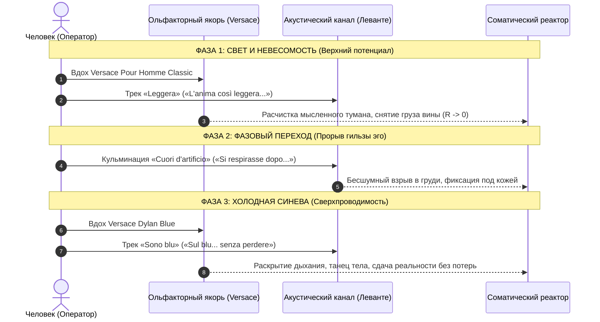

# ТРИПТИХ СВЕРХПРОВОДИМОСТИ
## Леванте, Versace и Внутренний ток: Акустико-ольфакторная онтология фазового перехода
**Автор:** Владимир Аньянов  
**Музыкально-онтологический фокус:** Claudia Lagona (Levante)  
**Ольфакторный консилиенс:** Серия Versace (Pour Homme Classic, Dylan Blue)

---

# Слово автора: Почему родилась эта книга

Я отчётливо помню этот вечер. Я работал над теорией «Внутреннего тока» — перепроверял формулы, выстраивал строгую биекцию между законами электродинамики и соматическим аппаратом человека. На экране монитора светились законы Кирхгофа, закон Джоуля — Ленца ($Q = I^2 R t$), формулы обнуления сопротивления эго ($R_{\text{ego}} \to 0$) и принципиальная схема человеческого счастья как замкнутого сверхпроводящего контура.

Всё складывалось с математической строгостью. Но внутри оставался фундаментальный вопрос, мучивший меня:  
*«Схемы, логика, графики — это великолепно для неокортекса. Но человек страдает не в неокортексе. Человек страдает в спазме фасций, в оцепенении блуждающего нерва, в лимбическом ужасе Дефолт-системы мозга (DMN). Как передать физику сверхпроводимости туда, куда не проникают слова?»*

В этот момент в наушниках на повторе играла песня итальянской певицы Леванте (Claudia Lagona) — «Cuori d'artificio». Я слушал её десятки раз подряд. И внезапно меня пронзило ослепительное озарение: в её голосе звучал запредельный, разрывающий грудь вокальный надрыв — **но в нём не было ни капли отчаяния**.

Люди веками путают надрыв с отчаянием. Но между ними лежит непреодолимая пропасть. Отчаяние — это глухой омический тупик бесконечного сопротивления ($R \to \infty$), где ток заперт, выхода нет и энергия выжигает человека изнутри. А надрыв в песне Леванте — это не поломка! Это **фазовый переход вещества при критической температуре $T_c$**. Это момент, когда сжатая пружина эго лопается, выделяется скрытая теплота превращения, и сердце взрывается светом в открытое небо.

А дальше была строка, от которой перехватывает дыхание:
> *«Io, che non credevo affatto si respirasse dopo / Mi abbaglia ancora adesso quell'esplosione al petto che non fa mai rumore»*  
> *(«Я, которая совсем не верила, что после этого дышат... Меня до сих пор ослепляет этот взрыв в груди, который не производит ни звука...»)*

В этих двух строках было сказано то, ради чего пишутся многотомные философские трактаты: **за порогом эго не наступает смерть — за порогом эго начинается настоящее дыхание!** И этот взрыв происходит в абсолютной тишине Мусин.

---

### Эволюция от кризиса к невесомости: Почему «Leggera» заменила «Vivo»

В первом черновике этой брошюры открывающим актом была песня «Vivo» (Сан-Ремо 2023). Песня мощная, честная, вскрывающая опыт послеродовой депрессии. Но чем дольше я вслушивался в неё, тем яснее становилось: в «Vivo» слишком много надрыва, напряжения нервов и следов гражданской войны субличностей. Там всё ещё слышен бой за право жить: *«A costo di cedere parti di me»* («Ценой отдачи частей себя»). Это фаза тяжёлого кризиса, где свет пробивается сквозь боль, но в ней ещё нет подлинной лёгкости.

И тогда открылась песня **«Leggera»** (альбом *Opera futura*, 2023). 

Когда я вчитался в проверенный оригинальный итальянский текст «Leggera», всё встало на свои места:
> *«Ho perdonato il mio nome / Ritrovato l'umore / Ora che non fa più male abbandonarsi alla vita...»*  
> *(«Я простила своё имя, вернула настроение, теперь, когда больше не больно сдаться жизни...»)*  
> *«Ho l'anima così leggera che non mi sembra vero di volare alto / Sotto i piedi ho ancora tanto cielo...»*  
> *(«Моя душа настолько лёгкая, что мне не верится, как высоко я лечу / Под ногами у меня ещё так много неба...»)*  
> *«Quanti sogni servono a sentir di meritare? Quanti sogni servono a volare?»*  
> *(«Сколько ещё иллюзий нужно уму, чтобы разрешить себе чувствовать себя заслуживающим? Сколько нужно, чтобы летать?»)*

«Leggera» — это состояние **уже произошедшего освобождения**. Это невесомость пёрышка (*piuma*), летящего над землёй без сопротивления. В ней снято чувство вины, прощено собственное имя (ярлык эго), растворен синдром самозванца и прекращён омический спазм. Под ногами расстилается бездонное небо.

---

### Великое совпадение: «Sono blu» и ольфакторно-акустический триптих

Затем последовал декабрьский сингл 2025 года — **«Sono blu»**. Когда я услышал проверенные авторские строки:
> *«Che non ho bruciato invano per scaldare un vuoto d'aria...»*  
> *(«Что я не сгорела вхолостую, чтобы согревать пустоту воздуха...»)*  
> *«Il terrore / Il dolore è dentro a una bugia che credo ancora vera...»*  
> *(«Ужас и боль — внутри лжи, которую я всё ещё считаю правдой...»)*  
> *«La resa alle volte è la scelta migliore, senza perdere»*  
> *(«Сдача иногда — это лучший выбор, без единой потери»)*.

Она спела закон Джоуля — Ленца чистым языком поэзии! Она доказала, что боль порождается ментальной ложью ума («bugia»), что танец тела взламывает спазм нервов, а сдача сопротивления — это не позорная капитуляция, а триумф сверхпроводимости, в котором ты ничего не теряешь.

И здесь замкнулся ольфакторный и акустический круг Триптиха:
1. **Прозрачный хрусталь и цитрусовый воздух Versace Pour Homme Classic** — **«Leggera»** (Верхний потенциал, невесомость, чистое небо под ногами);
2. **Взрыв фазового перехода и высвобождение скрытой теплоты** — **«Cuori d'artificio»** (Разрыв гильзы эго, соматическое дыхание за порогом);
3. **Глубокий синий кобальт Versace Dylan Blue** — **«Sono blu»** (Сверхпроводимость, динамический поток, сдача реальности без единой потери).

Обонятельный тракт не проходит таможню неокортекса: он бьёт прямо в лимбический реактор за 150 миллисекунд. Соединив аромат и музыку, мы получаем калибровочный прибор мгновенного действия.

*Владимир Аньянов*  
*Октябрь 2026*

---

# Архитектура Триптиха: Три фазы Сверхпроводимости

```
АКТ I: «LEGGERA»
Фаза: Невесомость и свет
Код: "L'anima così leggera"
   |
   v
АКТ II: «CUORI D'ARTIFICIO»
Фаза: Фазовый переход
Код: "Si respirasse dopo..."
   |
   v
АКТ III: «SONO BLU»
Фаза: Сверхпроводимость
Код: "La resa senza perdere"
```

| Уровень цепи | Стихия | Ольфакторный якорь | Трек Леванте | Электродинамика |
| :--- | :--- | :--- | :--- | :--- |
| **I. Верхний потенциал** | Воздух | Pour Homme Classic | «Leggera» (2023) | Напряжение (U): снятие сопротивления, невесомость |
| **II. Фазовый скачок** | Огонь | (Импульс разряда) | «Cuori d'artificio» (2014) | Фазовый переход (Tc): прорыв эго, дыхание за порогом |
| **III. Рабочий поток** | Вода | Dylan Blue | «Sono blu» (2025) | Сверхпроводимость (R -> 0): сдача реальности без потерь |

---

# Акт I. Невесомость и Чистый Свет: «Leggera»
### Снятие морального груза, парение над небом и отмена синдрома самозванца
**Ольфакторный якорь:** *Versace Pour Homme Classic* (прозрачный хрусталь, бергамот, нероли, кедр)

```
Fino a qui mi sembra bene
Ho perdonato il mio nome
Ritrovato l'umore
Pronunciato tutte le parole

Ora che non fa più male
Abbandonarsi alla vita
Che vita la vita
Fa sperare che non sia finita mai

Ho l'anima così leggera
Che non mi sembra vero di volare alto
Sotto i piedi ho ancora tanto cielo, ancora

Domino le mie paure
Quando la musica è forte
Fa sparire la notte
Chissà dove il mondo va a finire

Agito le braccia e il corpo
Mi muovo dentro lo spazio
Senza tempo io ballo
Non ho tempo ma ballo
Balla, ballerina

Ho l'anima così leggera
Che non mi sembra vero di volare alto
Sotto i piedi ho ancora tanto cielo, ancora

Anima così leggera
Che non mi ferma niente
Non mi serve il vento per andare oltre
Superarmi ancora e ancora

Ma quanti sogni servono a distinguere l'amore?
Quanti sogni servono a salvarsi da un dolore?
Quanti sogni servono a sentir di meritare?
Quanti sogni servono a volare, volare?

Anima così sincera
Che non ti sembra vero quanto volo in alto
Sotto i piedi ho ancora questo cielo, ancora
Questo cielo ancora
```

---

## Электродинамический аудит «Leggera»

### 1. Прощение имени и разгрузка реостата
*«Fino a qui mi sembra bene / Ho perdonato il mio nome / Ritrovato l'umore / Pronunciato tutte le parole»*  
*(«До сих пор всё кажется хорошим / Я простила своё имя / Вернула хорошее настроение / Произнесла все слова»)*

Что такое «простить своё имя»? Имя — это социальная маска эго (Персона), на которую общество навешивает ожидания, долги и вину. Пока человек защищает своё имя, он непрерывно греет проводку трением обид. Простить своё имя — значит разоружить эго-контур ($R_{\text{ego}} \to 0$). Горловой спазм отпускает («произнесла все слова»), а природный потенциал возвращается в нормальный рабочий режим («ritrovato l'umore»).

### 2. Безболезненная сдача жизни
*«Ora che non fa più male / Abbandonarsi alla vita / Che vita la vita / Fa sperare che non sia finita mai»*  
*(«Теперь, когда больше не больно / Сдаться жизни / Какая жизнь эта жизнь / Дарит надежду, что она никогда не закончится»)*

Фундаментальный постулат Системы Аньянова: **сопротивление рождает боль**. Когда эго борется с потоком бытия, контакт искрит и греется. Но в точке сдачи (*abbandonarsi alla vita*) боль исчезает без следа. Реальность дружественна и безопасна по своей природе.

### 3. Чистое небо под ногами
*«Ho l'anima così leggera / Che non mi sembra vero di volare alto / Sotto i piedi ho ancora tanto cielo, ancora»*  
*(«У меня душа настолько лёгкая / Что мне не верится, что лечу так высоко / Под ногами у меня ещё так много неба, ещё»)*

Это физическое состояние парения. Человек привык, что небо должно быть над головой, а под ногами — жёсткая земля или пропасть. Но в невесомости сверхпроводимости под ногами оказывается само небо! Ты паришь в бесконечном пространстве потенциала, не испытывая страха высоты, потому что масса эго обнулилась.

### 4. Взлом временной петли в танце тела
*«Agito le braccia e il corpo / Mi muovo dentro lo spazio / Senza tempo io ballo / Non ho tempo ma ballo / Balla, ballerina»*  
*(«Двигаю руками и телом / Перемещаюсь внутри пространства / Вне времени я танцую / У меня нет времени, но я танцую / Танцуй, балерина»)*

Точнейшее описание принципа **Мусин (無心)**:
- Ум живёт во времени (*tempo*), подсчитывая дефициты и строя тревожные прогнозы («у меня нет времени»).
- Тело движется в пространстве (*spazio*), мгновенно выходя в безвременье (*senza tempo*).
Включение соматического аппарата через танец и движение выбивает реостат ума за доли секунды.

### 5. Автономия генератора: без попутного ветра
*«Non mi serve il vento per andare oltre / Superarmi ancora e ancora»*  
*(«Мне не нужен ветер, чтобы идти дальше / Превосходить себя снова и снова»)*

Суверенный человек не зависит от внешних похвал, одобрения среды или «благоприятных обстоятельств» (попутного ветра). Внутренний генератор автономно вырабатывает всю необходимую ЭДС для непрерывного созидательного движения.

### 6. Сокрушение синдрома самозванца
*«Ma quanti sogni servono a distinguere l'amore? / Quanti sogni servono a salvarsi da un dolore? / Quanti sogni servono a sentir di meritare? / Quanti sogni servono a volare, volare?»*  
*(«Но сколько иллюзий нужно, чтобы распознать любовь? / Сколько иллюзий нужно, чтобы спастись от боли? / Сколько иллюзий нужно, чтобы почувствовать себя заслуживающим? / Сколько иллюзий нужно, чтобы летать, летать?»)*

Коронный удар по ментальным лабиринтам неокортекса! Сколько условий, дипломов, чужих оценок и надуманных снов («sogni») нужно изобрести уму, чтобы разрешить себе просто чувствовать себя заслуживающим (*sentir di meritare*)? Ни одного. Полёт — это не награда за страдания. Полёт — это естественное свойство лёгкого проводника.

---

# Акт II. Фазовый переход: «Cuori d'artificio»
### Выделение скрытой теплоты, преодоление страха смерти и бесшумный взрыв в открытом небе

```
Io, che non sapevo niente dell'odio e dell'amore
Ho fatto in fretta ad imparare
Com'è che scoppia il cuore.
Come mi scoppia il cuore.
E poi via, sparso nell'aria fluttua e va la fonte dei miei guai

Ma no, non vedi come scende
No, non vedi come cade giù.
Non è polvere di stelle, non è neve no, non è Gesù.
No, non vedi come scende
No, non vedi come cade giù.
Non è polvere di stelle, non è neve no, non è Gesù

Io, che non credevo affatto si respirasse dopo
Mi abbaglia ancora adesso quell'esplosione al petto
Che non fa mai rumore.
Che non mi fa rumore.
E che paura se cade a terra
No, è esploso prima.
Ho un cuore che ha puntato tra le stelle
Eppure vivo sotto questa pelle

Ma no, non vedi come scende
No, non vedi come cade giù.
Non è polvere di stelle, non è neve no, non è Gesù.
No, non vedi come scende
No, non vedi come cade giù.
Non è polvere di stelle, non è neve no, non è Gesù
```

---

## Электродинамический аудит «Cuori d'artificio»

### 1. Делокализация узла сопротивления
*«Com'è che scoppia il cuore... E poi via, sparso nell'aria fluttua e va la fonte dei miei guai»*  
*(«Как это взрывается сердце... И затем прочь, рассеянный в воздухе, парит и улетает источник моих бед»)*

«Источник моих бед» (*la fonte dei miei guai*) — это локализованный узел эго-сопротивления ($R_{\text{ego}}$): спрессованный комок обиды, гордости и страха. Вся трагедия держится на том, что этот узел удерживает плотную форму. Когда гильза взрывается, узел распадается на миллионы микрочастиц и рассеивается в атмосфере. У боли больше нет адресата.

### 2. Главная формула: Дыхание за порогом эго
*«Io, che non credevo affatto si respirasse dopo / Mi abbaglia ancora adesso quell'esplosione al petto che non fa mai rumore»*  
*(«Я, которая совсем не верила, что после этого дышат... Меня до сих пор ослепляет этот взрыв в груди, который не производит ни звука...»)*

Центральная аксиома всей книги:
Эго шепчет: *«Держись за контроль! Если ты отпустишь хватку — наступит смерть»*.  
Но в момент сдачи наступает ошеломляющее открытие: **«si respirasse dopo» — после этого дышат!**  
И этот взрыв беззвучен (*«che non fa mai rumore»*). Шум в физике — это трение. В контуре шум — это искрение омического балласта. При $R \to 0$ трение исчезает. Переход совершается в абсолютной тишине чистого света.

### 3. Соматический якорь: Жизнь под живой кожей
*«E che paura se cade a terra / No, è esploso prima... / Ho un cuore che ha puntato tra le stelle... eppure vivo sotto questa pelle»*  
*(«И как страшно, если упадёт на землю / Но нет, оно взорвалось раньше... У меня сердце, которое целилось к звёздам... и всё же я живу под этой кожей»)*

Ракета не разбивается оземь, потому что взрывается в зените (*«No, è esploso prima»*), отдав весь потенциал свету. И здесь Леванте ставит якорь против ложного духовного бегства: да, сердце целилось к звёздам, но **«eppure vivo sotto questa pelle»** — **я живу под этой живой кожей!** Ток циркулирует прямо в теле.

---

# Акт III. Сверхпроводимость: «Sono blu»
### Закон Джоуля — Ленца чистым текстом, соматический танец и сдача реальности без потерь
**Ольфакторный якорь:** *Versace Dylan Blue* (глубокий кобальт, амброксан, лист инжира, морская акватика)

```
Dimmi cosa credi di me
Sono qui
Guardami negli occhi e giura
Non arriverà mai il tempo per ferire un cigno in aria
Dimmi cosa credi di me
Sul blu
La notte non mi fa paura
Il terrore è dentro a una bugia che credo ancora vera

Tremila dove non c'è luce
Nascondi la verità

La rabbia, la fede, la croce sul cuore
La forza, l'attesa, le nostre parole
L'istante in cui sento che è tempo di andare
Senza perdere

Dimmi cosa credi di me
Sono io
Usa la tua voce e giura
Che non ho bruciato invano per scaldare un vuoto d'aria
Dimmi cosa credi di me
Sul blu
L'abisso non mi fa paura
Il dolore è dentro a una bugia che penso ancora vera

Tremila dove non c'è luce
Nascondi la verità

La rabbia, la fede, la croce sul cuore
La forza, l'attesa, le nostre parole
L'istante in cui sento che è tempo di andare
Senza perdere
La forza, la scelta, la pace sul cuore
La forza, la vita che qui non si muore
La resa alle volte è la scelta migliore
Senza perdere

Pochi fiammi, fari, luci
Più deboli ombre sui dei calici
Punti sui passi spediti
Per nuovi indizi che mai ci daranno

La stretta sui nervi
Le cose che devi
Il buio che inventi
La danza ostinata di un corpo che muove
Un passo più indietro, la forza che sale
La resa alle volte è la scelta migliore
Senza perdere
Senza perdere
Senza perdere
Sul blu
```

---

## Электродинамический аудит «Sono blu»

### 1. Неуязвимость потока и разоблачение ментальной лжи
*«Non arriverà mai il tempo per ferire un cigno in aria... Il terrore è dentro a una bugia che credo ancora vera»*  
*(«Никогда не придёт время, чтобы ранить лебедя в воздухе... Ужас — внутри лжи, которую я всё ещё считаю правдой»)*

Пока проводник статичен и зафиксирован на рефлексии эго, он уязвим. Но лебедя **в воздухе** — в динамическом потоке ($I > 0$) — ранить невозможно! Поток неуязвим.  
И величайшее открытие онтологии: страх и ужас живут не в темноте мира, а **строго внутри ментальной лжи ума («bugia»)**. Сама Реальность сопротивления не имеет. Снимите ложь — и страдание исчезнет мгновенно.

### 2. Закон Джоуля — Ленца чистым текстом
*«Che non ho bruciato invano per scaldare un vuoto d'aria...»*  
*(«Что я не сгорела вхолостую, чтобы отапливать пустоту воздуха...»)*

Поэтическая формулировка фундаментального закона тепловых потерь ($Q = I^2 R t$): когда человек борется с фантомами ума, колоссальный ток жизни выжигается впустую, отапливая пустоту воздуха. Леванте фиксирует суверенную границу: паразитный нагрев прекращён.

### 3. Танец тела против спазма нервов
*«La stretta sui nervi / Le cose che devi / Il buio che inventi / La danza ostinata di un corpo che muove»*  
*(«Спазм нервов / Долженствования / Тьма, которую ты выдумываешь / Упрямый танец движущегося тела»)*

- Спазм нервов (*la stretta sui nervi*), социальные долги (*le cose che devi*), выдуманная тьма тревоги (*il buio che inventi*) — это омический ад Дефолт-системы (DMN).
- Упрямый танец движущегося тела (*la danza ostinata di un corpo che muove*) — это соматический сброс в Мусин. Тело возвращает управление себе.

### 4. Великая сдача без потерь: Формула Сверхпроводимости
*«La resa alle volte è la scelta migliore / Senza perdere... Sul blu»*  
*(«Сдача иногда — это лучший выбор / Ничего не теряя... В синеве»)*

Эго панически боится «сдаться», считая это позором и капитуляцией. Леванте поёт чистую истину физики: **сдача реальности — это лучший выбор, в котором ты ничего не теряешь!**  
Потому что сдача — это не проигрыш внешнему врагу. Это **сброс паразитного сопротивления в ноль ($R \to 0$)**. Энергия перестаёт сгорать в тепло и входит в холодную, кристальную синеву (*«Sul blu»*) — температуру абсолютного нуля омического ада.

---

# Практическое руководство: Калибровочный протокол
### Как применять Триптих в жизни для мгновенного входа в Сверхпроводимость



### 9-минутный протокол Триптиха Сверхпроводимости

1. **Минуты 0:00 — 3:00 («Leggera»): Включение света и прощение имени.**  
   Вдохните цитрусовую прохладу *Versace Pour Homme Classic*. Включите «Leggera». Отпустите претензии к себе. Снимите груз вины и чужих ожиданий: *«Ho perdonato il mio nome»*. Почувствуйте, как голова становится лёгкой и ясной, а под ногами распахивается небо.
2. **Минуты 3:00 — 6:00 («Cuori d'artificio»): Фазовый переход.**  
   Включите трек. Разрешите любому зажиму в груди лопнуть. Зафиксируйте соматический факт: **за порогом эго дышат!** Ощутите себя живым прямо под своей человеческой кожей (*sotto questa pelle*).
3. **Минуты 6:00 — 9:00 («Sono blu»): Вход в холодную синеву.**  
   Нанесите *Dylan Blue*. Двигайтесь мягко в ритм музыки (*la danza di un corpo*). Осознайте: тревога жила лишь внутри ментальной лжи. Сдайтесь реальности прямо сейчас: **в этой сдаче нет потерь**. Вы вошли в режим сверхпроводимости.

---

# Манифест Итальянского Тандема
### Послание, цель и демонстрация в трёх зеркалах

> **«Счастье и внутренняя сила — это не абстрактная философия, которую нужно годами доказывать умом или заслуживать страданиями. Это физическое состояние твоего тела, в которое ты возвращаешься за 150 миллисекунд прямо сейчас».**

```
               АНАТОМИЯ ЧЕЛОВЕКА В ТРЁХ ЗЕРКАЛАХ ТРИПТИХА:

1. ТВОЯ ГОЛОВА: СВЕТ (Versace Pour Homme Classic + «Leggera»)
   «Посмотри: твоя голова — это не тюрьма для тревог и не арена сомнений. 
   Это чистый хрустальный фонарик. Твоя душа может быть настолько легкой 
   (l'anima così leggera), что под ногами остаётся только небо».

2. ТВОЁ СЕРДЦЕ: ПРОРЫВ (Импульс разряда + «Cuori d'artificio»)
   «Разреши зажиму лопнуть. За порогом эго дышат (si respirasse dopo). 
   Этот бесшумный взрыв в груди возвращает тебя к жизни прямо под твоей кожей».

3. ТВОЁ ДЕЙСТВИЕ: СВЕРХПРОВОДИМОСТЬ (Versace Dylan Blue + «Sono blu»)
   «Посмотри: действовать в социуме можно без надрыва и трения. 
   Сдача сопротивления (la resa) — это не поражение, это холодная синева 
   сверхпроводимости. Ты можешь созидать, не сгорая дотла».
```

### Аксиома Сверхпроводимости:
$$\lim_{R_{\text{ego}} \to 0} Q_{\text{loss}} = 0 \implies P_{\text{life}} = E \cdot I$$

*Счастье — это не отсутствие трудностей. Счастье — это режим сверхпроводимости, в котором ток жизни течёт без сопротивления.*

---
*Санкт-Петербург — Таганрог — Милан — Катания, 2026*
